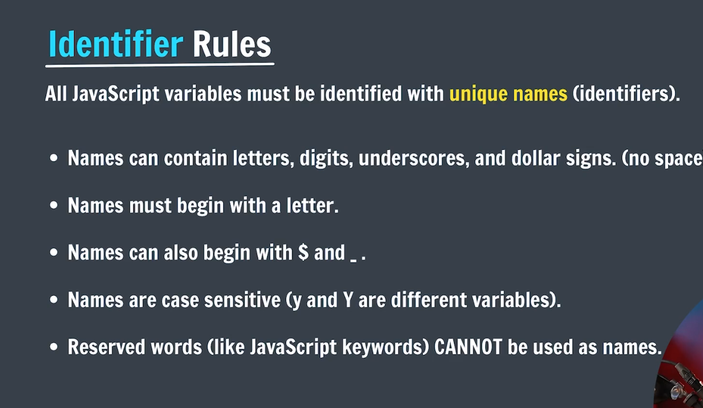
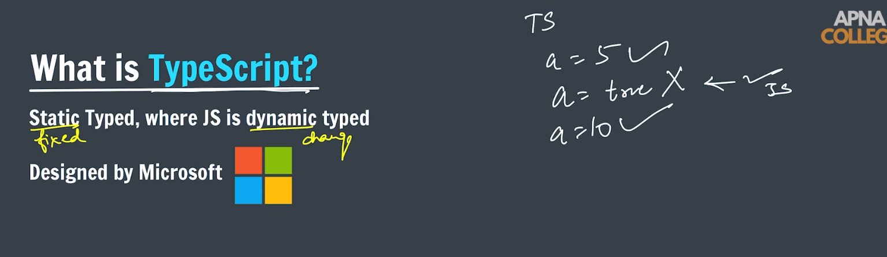
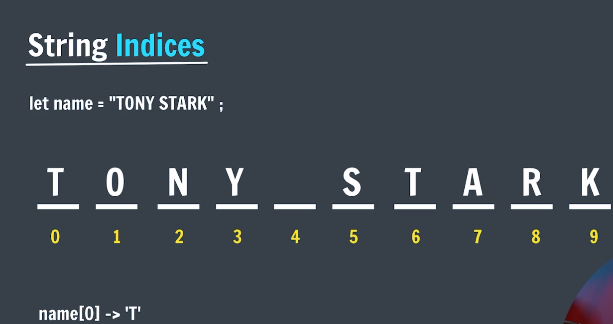
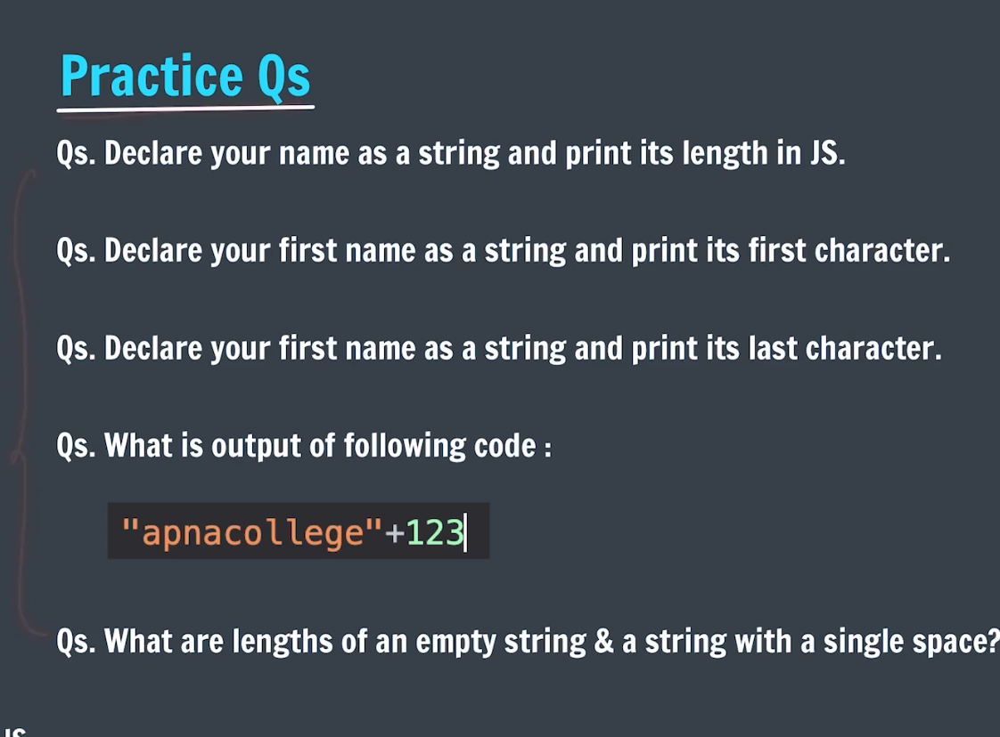
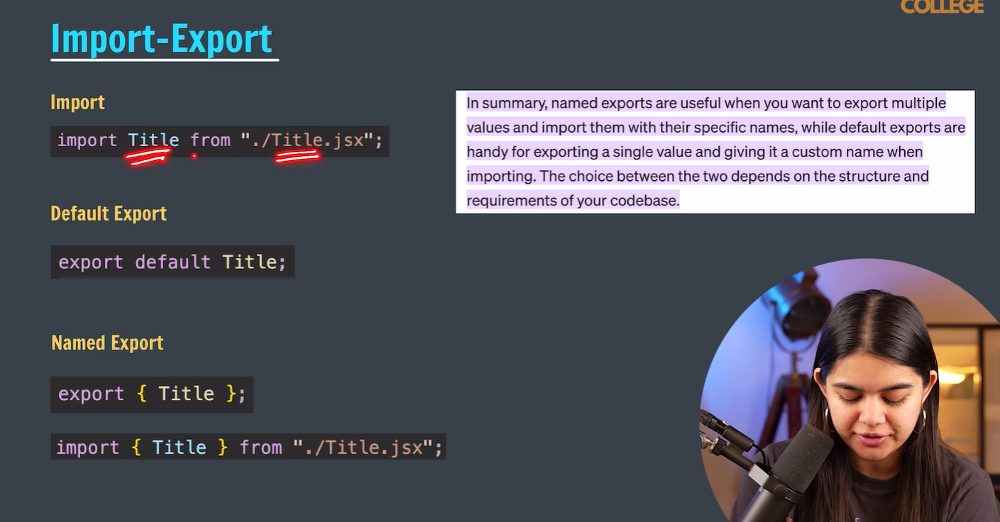
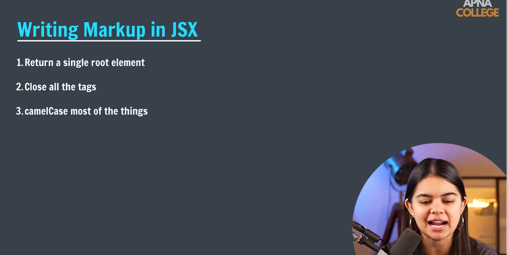

# Delta-Batch

📚 A structured collection of code, projects, and practice from the Delta Batch (Apna College), focused on full-stack web development using the MERN stack and modern web technologies.

---

## Js Part-1:
## 🖥 Using Console

* **REPL** - Read, Evaluate, Print, Loop: A simple way to quickly test and debug JavaScript code directly in the console.
* Useful for experimenting with code snippets before adding them to your project.

---

## 🏷 Variable

* A **variable** is a named storage location in memory used to store data.
* It allows you to reference and manipulate values easily throughout your code.


---

## 🧩 Datatypes in JS

* Every piece of data in JavaScript has a **type**, which defines how it behaves and what operations can be performed on it.
* Common types: Number, String, Boolean, Undefined, Null, Object, Symbol.


---

## 🔢 Numbers in JS

* Numbers are used for arithmetic operations, calculations, and representing numerical values.
* JavaScript supports integers, floats, and special numeric values like Infinity and NaN.


---

## ➕➖ Operations in JS

* Operations allow you to perform calculations or manipulate values.
* Examples: addition (+), subtraction (-), multiplication (*), division (/), modulus (%).


---

## ❌ NaN in JS

* **NaN** stands for Not-a-Number and represents an invalid numerical operation.
* Useful to detect errors in arithmetic computations.


---

## ⚡ Operator Precedence

* Determines the order in which operators are evaluated in an expression.
* Important to understand to avoid unexpected results in calculations.


---

## ✏️ Practice Questions

* Practice applying different operations, variables, and types to strengthen understanding.


---

## 📝 Assignment Operators

* Assignment operators assign values to variables and can combine arithmetic operations, e.g., `+=`, `-=`, `*=`, `/=`.


---

## 🔺 Unary Operators

* Unary operators act on a single operand.
* Examples: Increment (++), Decrement (--), Logical NOT (!).


---

## ⬆️ Pre Increment / Post Increment

* **Pre-increment (`++x`)**: Increments the value before using it in an expression.
* **Post-increment (`x++`)**: Uses the current value first, then increments.


---

## ✏️ Practice Questions

* Reinforce understanding of operators, arithmetic, and increment/decrement operations.


---

## 🔑 Identifiers Rules

* Identifiers are names used for variables, functions, and classes.
* Must start with a letter, `_`, or `$`; cannot be a reserved keyword.



## Writing of Identifiers

* Use descriptive names to make your code readable and maintainable.
* Follow camelCase convention for variables and functions.


---

## ✅ Boolean in JS

* Boolean values represent **true** or **false**.
* Often used in conditional statements and logic operations.


---

## 💻 TypeScript

* A superset of JavaScript that adds **static typing**.
* Helps detect errors early and improves code maintainability.



---

## ✏️ Practice Questions

* Exercises to apply Booleans, conditions, and TypeScript basics.


---

## 📝 String in JS

* Strings are sequences of characters used to represent text.
* Strings can be manipulated, concatenated, and accessed using indices.


---

## 🔢 String Indices

* Access individual characters using index notation: `string[index]`.
* Use `string.length` to get the number of characters.



---

## 🔗 Concatenation

* Combine strings using the `+` operator or template literals for dynamic text.


---

## 🚫 Null / Undefined

* **Undefined**: Variable declared but not assigned.
* **Null**: Represents the intentional absence of a value.


---

## ✏️ Practice Questions

* Apply knowledge of strings, Booleans, null/undefined, and other types to solve exercises.



---


# React Basics – First Project 🚀

Simple starter React project to learn and understand the very basics.

Created with **Vite + React**  
Perfect for absolute beginners!

---

## 📋 What You'll Learn Here

- How to create a React project with Vite  
- Project folder structure  
- Creating & using components  
- Import / Export in React  
- Basic JSX rules & writing HTML in JS  
- Using curly braces `{}` for JavaScript inside JSX

---

## ⚡ Quick Start

```bash
# 1. Create new project
npm create vite@latest react-basics -- --template react

# 2. Enter project folder
cd react-basics

# 3. Install dependencies
npm install

# 4. Start development server
npm run dev


### 📂 Project Structure (most important files)

react-basics/
├── public/                 # static files (images, favicon...)
│   └── vite.svg
├── src/
│   ├── assets/             # your images usually go here
│   ├── components/         # ← put your components here (good habit)
│   │   └── Footer.jsx
│   ├── App.jsx             # main component
│   ├── main.jsx            # entry point (renders App)
│   ├── App.css
│   └── index.css           # global styles
├── index.html              # main HTML file
├── package.json
└── README.md             

🏗️ Your First Component Example:
// src/components/Footer.jsx
function Footer() {
  return (
      <p>Made with ❤️ in Karachi</p>
  )
}

export default Footer

### Import/Export:


### Writing Markup in JSX ✍️


✨ Most Important JSX Rules (MUST REMEMBER!):
--- 1. Use className instead of class
--- 2.JavaScript goes inside curly braces
--- 3.{/* Comments look like this
--- 4. JavaScript goes inside curly braces
