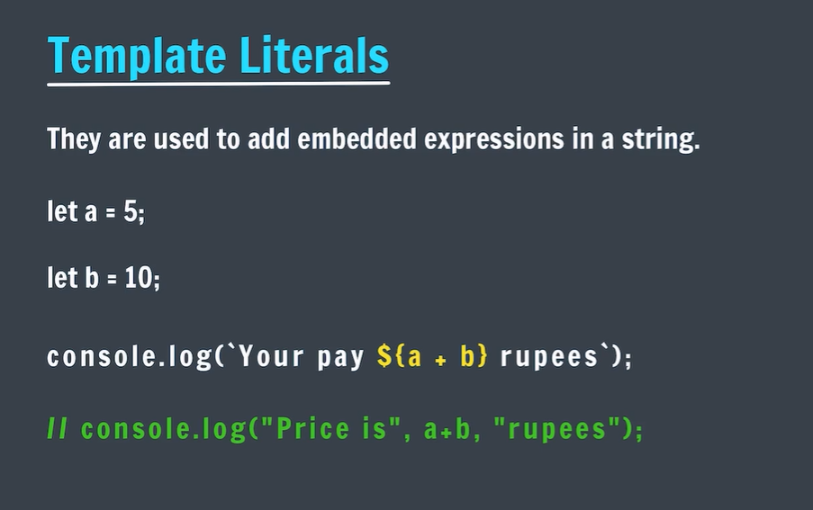
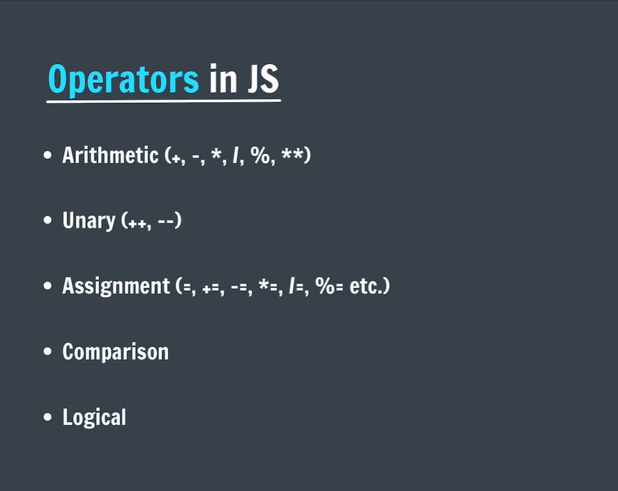
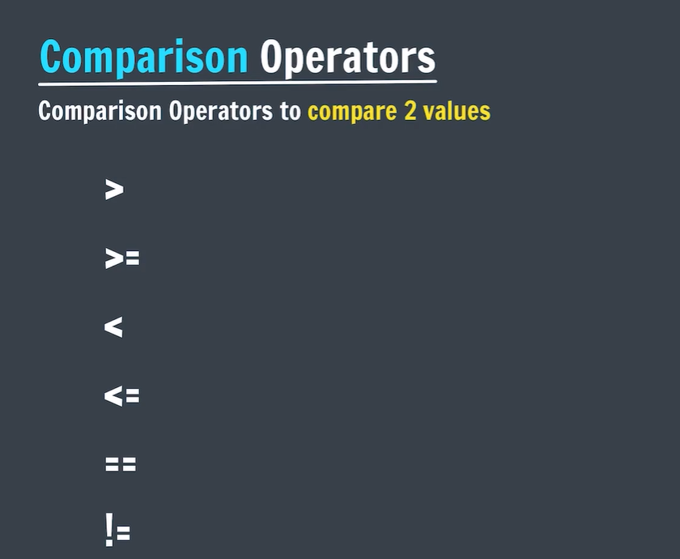
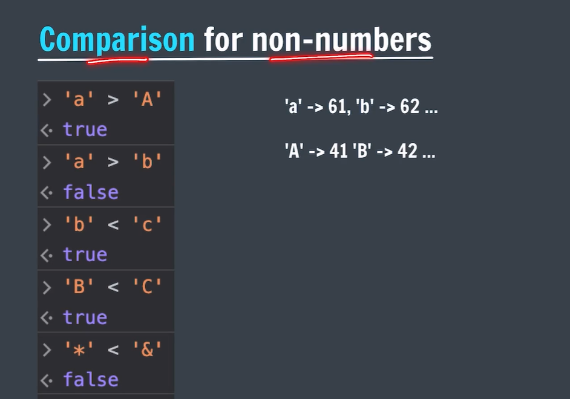
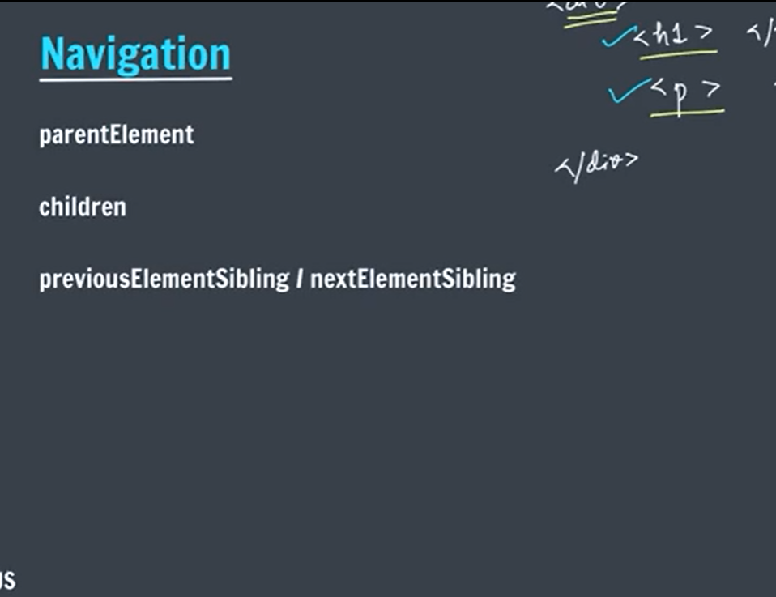
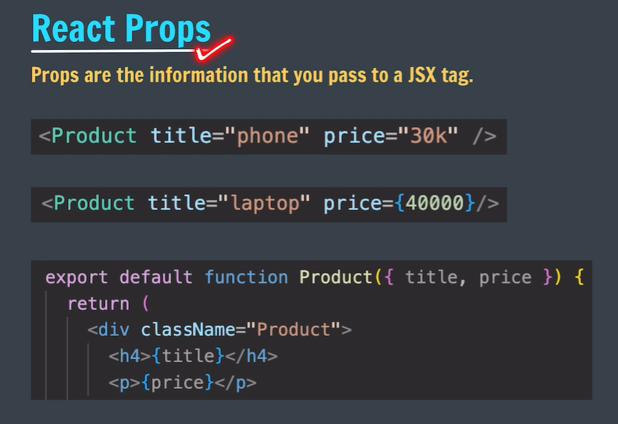

# Delta-Batch

📚 A structured collection of code, projects, and practice from the Delta Batch (Apna College), focused on full-stack web development using the MERN stack and modern web technologies.

---

## Js Part-1:
## 🖥 Using Console

* **REPL** - Read, Evaluate, Print, Loop: A simple way to quickly test and debug JavaScript code directly in the console.
* Useful for experimenting with code snippets before adding them to your project.

---

## 🏷 Variable

* A **variable** is a named storage location in memory used to store data.
* It allows you to reference and manipulate values easily throughout your code.


---

## 🧩 Datatypes in JS

* Every piece of data in JavaScript has a **type**, which defines how it behaves and what operations can be performed on it.
* Common types: Number, String, Boolean, Undefined, Null, Object, Symbol.


---

## 🔢 Numbers in JS

* Numbers are used for arithmetic operations, calculations, and representing numerical values.
* JavaScript supports integers, floats, and special numeric values like Infinity and NaN.


---

## ➕➖ Operations in JS

* Operations allow you to perform calculations or manipulate values.
* Examples: addition (+), subtraction (-), multiplication (*), division (/), modulus (%).


---

## ❌ NaN in JS

* **NaN** stands for Not-a-Number and represents an invalid numerical operation.
* Useful to detect errors in arithmetic computations.


---

## ⚡ Operator Precedence

* Determines the order in which operators are evaluated in an expression.
* Important to understand to avoid unexpected results in calculations.


---

## ✏️ Practice Questions

* Practice applying different operations, variables, and types to strengthen understanding.


---

## 📝 Assignment Operators

* Assignment operators assign values to variables and can combine arithmetic operations, e.g., `+=`, `-=`, `*=`, `/=`.


---

## 🔺 Unary Operators

* Unary operators act on a single operand.
* Examples: Increment (++), Decrement (--), Logical NOT (!).


---

## ⬆️ Pre Increment / Post Increment

* **Pre-increment (`++x`)**: Increments the value before using it in an expression.
* **Post-increment (`x++`)**: Uses the current value first, then increments.


---

## ✏️ Practice Questions

* Reinforce understanding of operators, arithmetic, and increment/decrement operations.


---

## 🔑 Identifiers Rules

* Identifiers are names used for variables, functions, and classes.
* Must start with a letter, `_`, or `$`; cannot be a reserved keyword.


## Writing of Identifiers

* Use descriptive names to make your code readable and maintainable.
* Follow camelCase convention for variables and functions.


---

## ✅ Boolean in JS

* Boolean values represent **true** or **false**.
* Often used in conditional statements and logic operations.


---

## 💻 TypeScript

* A superset of JavaScript that adds **static typing**.
* Helps detect errors early and improves code maintainability.


---

## ✏️ Practice Questions

* Exercises to apply Booleans, conditions, and TypeScript basics.


---

## 📝 String in JS

* Strings are sequences of characters used to represent text.
* Strings can be manipulated, concatenated, and accessed using indices.


---

## 🔢 String Indices

* Access individual characters using index notation: `string[index]`.
* Use `string.length` to get the number of characters.


---

## 🔗 Concatenation

* Combine strings using the `+` operator or template literals for dynamic text.


---

## 🚫 Null / Undefined

* **Undefined**: Variable declared but not assigned.
* **Null**: Represents the intentional absence of a value.


---

## ✏️ Practice Questions

* Apply knowledge of strings, Booleans, null/undefined, and other types to solve exercises.


---


### Console.log
-- to print things in console

### Linking Js File:
-- with script tag

### Template Literals:


### Operators in Js:


### Comparison Operators:


##  Comparison for non-numbers:



### If statement:


### DOM Navigation


# React :🚀

## 📋 What You'll Learn Here

- How to create a React project with Vite  
- Understanding project folder structure  
- Creating & using your first component  
- Import / Export in React  
- Basic JSX rules & writing HTML inside JavaScript  
- Using `{}` curly braces for JavaScript in JSX

## ⚡ Quick Start

```bash
# 1. Create new project
npm create vite@latest react-basics -- --template react

# 2. Enter project folder
cd react-basics

# 3. Install dependencies
npm install

# 4. Start development server
npm run dev
```

Open http://localhost:5173/ in your browser 🎉

## 📂 Project Structure (most important files)

```
react-basics/
├── public/                 # static files (images, favicon...)
│   └── vite.svg
├── src/
│   ├── assets/             # your images usually go here
│   ├── components/         # ← recommended: put components here
│   │   └── Footer.jsx
│   ├── App.jsx             # main/root component
│   ├── main.jsx            # entry point - renders App
│   ├── App.css
│   └── index.css           # global styles
├── index.html              # main HTML file
├── package.json
└── README.md               # ← you are here!
```

## 🏗️ Your First Component Example

```jsx
// src/components/Footer.jsx
function Footer() {
  return (
    <footer style={{ textAlign: 'center', padding: '2rem' }}>
      <p>Made with ❤️ in Karachi • {new Date().getFullYear()}</p>
    </footer>
  )
}

export default Footer
```

How to use it in `App.jsx`:

```jsx
import Footer from './components/Footer'

function App() {
  return (
    <div>
      <h1>Hello React! 👋</h1>
      <p>This is your first React project.</p>
      <Footer />
    </div>
  )
}

export default App
```

## 🔄 Import & Export Example


## ✍️ Writing Markup in JSX


## ✨ Most Important JSX Rules (MUST REMEMBER!)

1. Use **`className`** instead of `class`  
2. JavaScript expressions go inside **curly braces** → `{expression}`  
3. Comments in JSX → `{/* this is a comment */}`  
4. Every tag must be closed (self-closing tags too → ``)  
5. Use **fragments** when no parent element is needed → `<></>`
---


### React Fragments

In React, every component must return **one parent element**.  
To satisfy this rule, we often wrap elements inside a `<div>`.

However, extra `<div>` elements can create unnecessary nodes in the DOM.

**React Fragments** solve this problem by letting you group elements **without adding extra HTML elements** to the DOM.

#### Why Use React Fragments?
- Avoid extra `<div>` wrappers
- Keep the DOM clean
- Improve readability and structure

#### Two Ways to Use React Fragments

**1. Full Syntax**
```jsx
<React.Fragment>
  <h1>Hello</h1>
  <p>Welcome to React</p>
</React.Fragment>

###Short Syntax (Recommended):
<>
  <h1>Hello</h1>
  <p>Welcome to React</p>
</>


```
### Jsx With Curly Braces:
-- JSX, **curly braces `{}`** are used to write **JavaScript inside HTML-like code**.


## Structuring Components

Instead of rendering components multiple times again and again, a good practice is to **wrap related components inside a single parent component** and then render that parent component.

This approach helps to:

* Keep code clean and organized
* Improve reusability
* Make components easier to manage and maintain

---

## Styling Components

To style a component, you can use **Pure CSS**, **Tailwind CSS**, or **any other styling library**.

Steps to style a component:

1. Import the CSS file or styling library.
2. Use the required `className` or `id` on the component.
3. Apply styles to the selected elements.

This makes the UI consistent and easy to customize.

### React Props:
