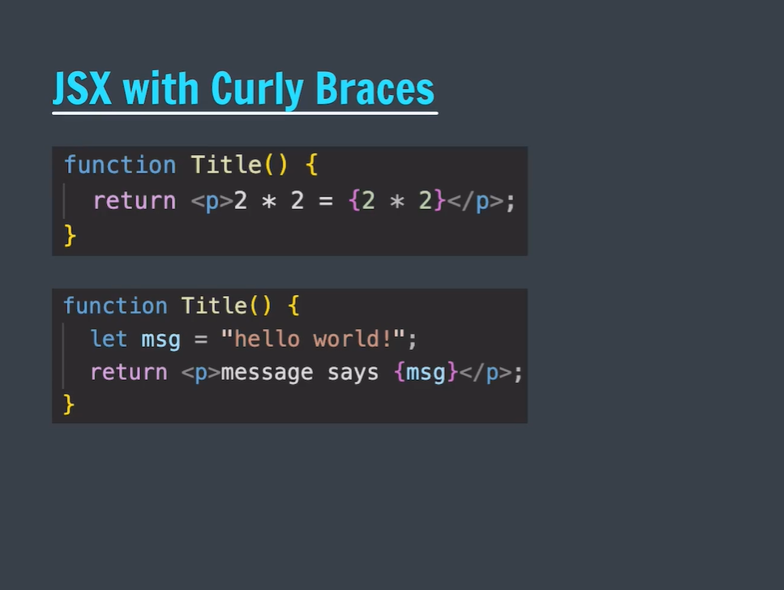

# Delta-Batch

A structured collection of code, projects, and practice from the Delta Batch (Apna College), focused on full-stack web development using the MERN stack and modern web technologies.

# using console

- REPL
- Read Evaluate Print Loop

# variable

to store value

